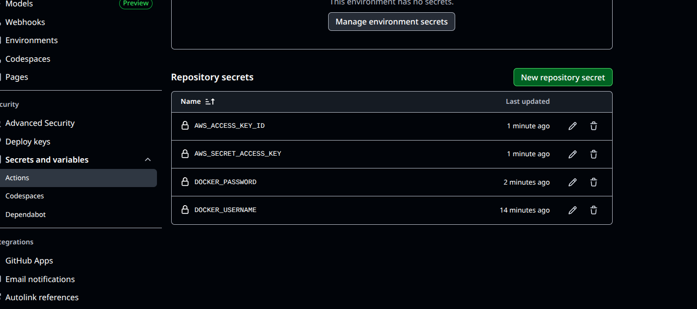

# Task 6 : Make a new github repository and make a github workflow to Build Push and start the terraform code do task-5

## 1. Strapi image
- First we have to setup our strapi app using
> npx create-strapi@latest
- Then we can create image of that app using the dockerfile
```dockerfile
FROM node
WORKDIR /opt/
COPY . .
RUN npm install -g node-gyp && npm config set fetch-retry-maxtimeout 600000 -g && npm install
ENV PATH=./node_modules/.bin:$PATH
RUN ["npm", "run", "build"]
EXPOSE 1337
CMD ["npm", "run", "develop"]
```
- Then we can run the commands to check if it is working fine or not.
> docker build -t imagename .

> docker run -d --name contname -p 1337:1337 --env-file .env imagemid

## 2. Github Workflow
Now we create a directory `.github/workflow`. In that we will mention the file name `deploy.yml`

- First we mention the pipeline name. And then we mention the trigger process, i.e trigger pipeline when ther eis push on main branch.

- Then we define the jobs, means the actual steps you are going to take. First we mention the deploy job where we want to push the image to the docker hub. 

- For that we have to define the creadentials in the `Github secrets`
```yml
name: Deploy Strapi

on:
  push:
    branches: [main]

jobs:
  deploy:
    runs-on: ubuntu-latest
    
    env:
      DOCKER_USERNAME: ${{ secrets.DOCKER_USERNAME }}
      DOCKER_PASSWORD: ${{ secrets.DOCKER_PASSWORD }}
      AWS_ACCESS_KEY_ID: ${{ secrets.AWS_ACCESS_KEY_ID }}
      AWS_SECRET_ACCESS_KEY: ${{ secrets.AWS_SECRET_ACCESS_KEY }}
```

- For this I am using this documentation [link](https://docs.github.com/en/actions/use-cases-and-examples/publishing-packages/publishing-docker-images)

- So for .env we will add all the secretes in Secrets by navigating to `Github repo > Settings > Secrets > Action`



- Then we checkout the code and login into out Docker Hub
```yml
    steps:
    # Fetching the code
    - name: Checkout code
      uses: actions/checkout@v4

    # Login to the Docker hub
    - name: Log in to DockerHub
      uses: docker/login-action@v3
      with:
        username: ${{ env.DOCKER_USERNAME }}
        password: ${{ env.DOCKER_PASSWORD }}
```

- Then we build the image and push the image

```yml
    # Build the image and push
    - name: Build and Push Docker Image
      uses: docker/build-push-action@v6
      with:
        context: ./strapi_task6
        file: ./app/Dockerfile
        push: true
        tags: ${{ secrets.DOCKER_USERNAME }}/strapi2:v${{ github.run_number }}
```

- Changes