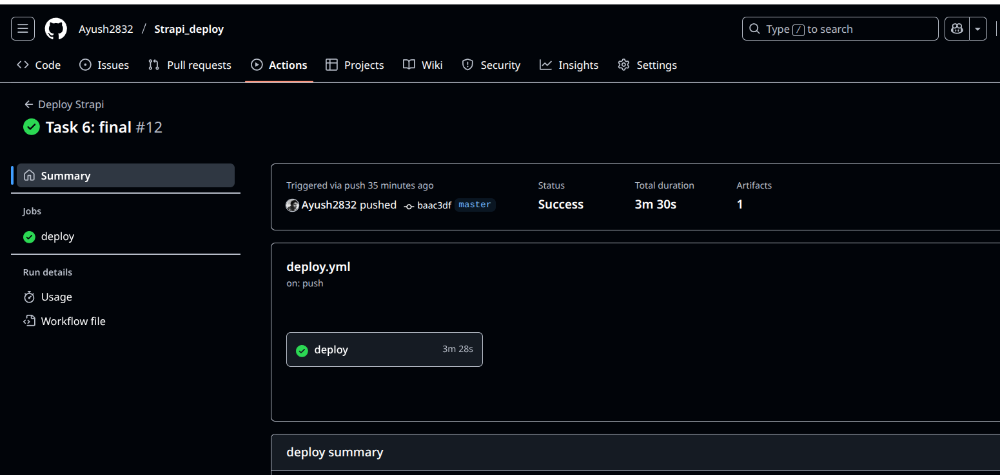
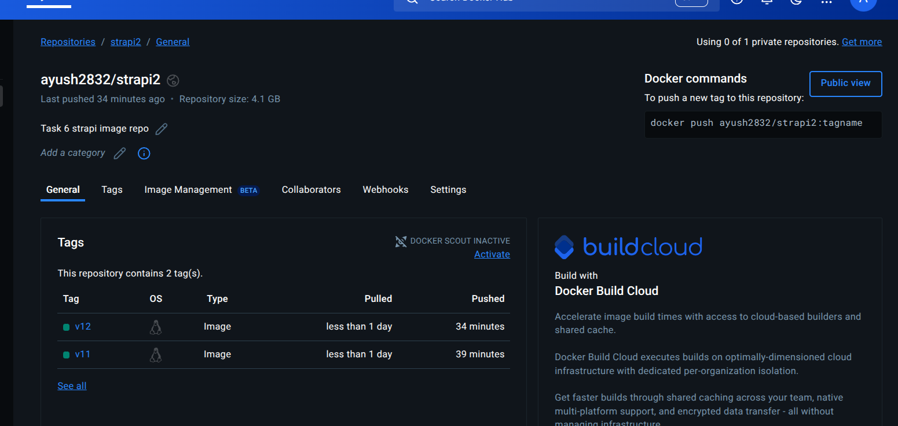
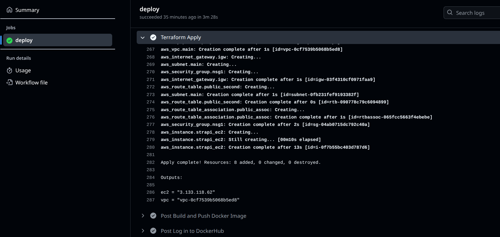
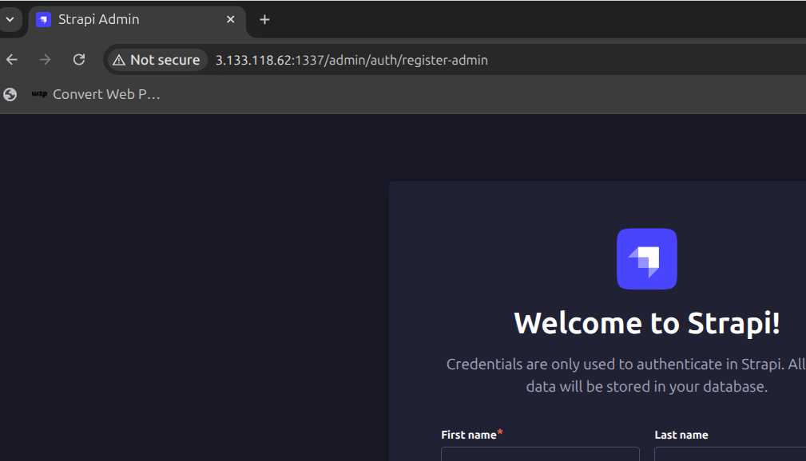
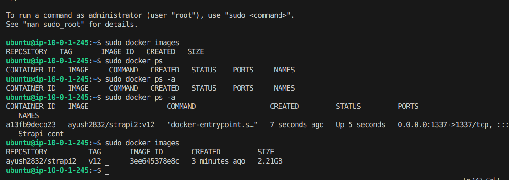

# Create github workflow to Build Push and start the terraform.

## 1. Strapi image
- First we have to setup our strapi app using
> npx create-strapi@latest
- Then we can create image of that app using the dockerfile
```dockerfile
FROM node
WORKDIR /opt/
COPY . .
RUN npm install -g node-gyp && npm config set fetch-retry-maxtimeout 600000 -g && npm install
ENV PATH=./node_modules/.bin:$PATH
RUN ["npm", "run", "build"]
EXPOSE 1337
CMD ["npm", "run", "develop"]
```
- Then we can run the commands to check if it is working fine or not.
> docker build -t imagename .

> docker run -d --name contname -p 1337:1337 --env-file .env imagemid

## 2. Github workflow file
Now we create a directory `.github/workflow`. In that we will mention the file name `deploy.yml`

- First we mention the pipeline name. And then we mention the trigger process, i.e trigger pipeline when ther eis push on main branch.

- Then we define the jobs, means the actual steps you are going to take. First we mention the deploy job where we want to push the image to the docker hub. 

```yml
name: Deploy Strapi

on:
  push:
    branches: [main]

jobs:
  deploy:
    runs-on: ubuntu-latest
    
    env:
      IMAGE_TAG: v${{ github.run_number }}
      IMAGE_NAME: ${{ secrets.DOCKER_USERNAME }}/strapi2
```

- For this I am using this documentation [link](https://docs.github.com/en/actions/use-cases-and-examples/publishing-packages/publishing-docker-images)

- So for .env we will add all the secretes in Secrets by navigating to `Github repo > Settings > Secrets > Action`


- Then we checkout the code and login into out Docker Hub
```yml
    steps:
    # Fetching the code
    - name: Checkout code
      uses: actions/checkout@v4

    # Login to the Docker hub
    - name: Log in to DockerHub
      uses: docker/login-action@v3
      with:
        username: ${{ env.DOCKER_USERNAME }}
        password: ${{ env.DOCKER_PASSWORD }}
```

- Then we build the image and push the image

```yml
    # Build the image and push
    - name: Build and Push Docker Image
      uses: docker/build-push-action@v6
      with:
        context: ./strapi_task6
        file: ./strapi_task6/Dockerfile
        push: true
        tags: ${{env.IMAGE_NAME}}:${{env.IMAGE_TAG}}
```

- Now we have to change the new version in our image, so that we pull the latest image which we pushed in the above.

```yml
    # Changing version of the image by coverting tlp file to scipt and passing arguments
    - name: Changing image version
      run: |
        IMAGE="${{ env.IMAGE_TAG }}"
        sed "s|{{docker_tag}}|$IMAGE|g" terraform/scriptcopy.sh.tpl > terraform/script.sh

    # Verify changes
    - name: Show generated script
      run: cat terraform/script.sh
```
- Here we are changing the tag in tpl file using the sed command, you can learn more about it [link](https://www.geeksforgeeks.org/php/what-is-tpl-file-in-php-web-design/). Below I have defined where we are chaging our bash file.
```bash
#!/bin/bash

# Install docker
sudo apt update -y
sudo apt install docker.io -y

# create .env file
cat <<EOF > /home/ubuntu/.env
# --Example env----
# Database
DATABASE_CLIENT=sqlite
DATABASE_HOST=
DATABASE_PORT=
DATABASE_NAME=
DATABASE_USERNAME=
DATABASE_PASSWORD=
DATABASE_SSL=false
DATABASE_FILENAME=.tmp/data.db
JWT_SECRET=bdipEHxkpPS5PNwYpj0dLA==
EOF

# Pull docker image and run 
sudo docker run -d --name Strapi_cont -p 1337:1337 --env-file /home/ubuntu/.env ayush2832/strapi2:{{docker_tag}} #<--here we are changing the tag ----
```

- Then we do rest of the Terraform init task
```yml
    # setup terraform and run Init and apply
    - name: terraform setup
      uses: hashicorp/setup-terraform@v3

    - name: Terraform init
      run: terraform init
      working-directory: ./terraform
```
- Then we run the apply command. Here we have defined the variable for our public key stored in the `Github secrets` which is used while creating ec2 instance.

```yml
    - name: Terraform Apply
      run: terraform apply -auto-approve -var="public_key=${{ secrets.PUBLIC_KEY }}"
      working-directory: ./terraform
      env:
        AWS_ACCESS_KEY_ID: ${{ secrets.AWS_ACCESS_KEY_ID }}
        AWS_SECRET_ACCESS_KEY: ${{ secrets.AWS_SECRET_ACCESS_KEY }}
```

## 3. Result
- Now that we have our `deploy.yml` file we will simply push the changes to the github and it will automatically run the pipeline. For that we have the command
> git add . && git commit -m "message"

> git push origin master

- Then it will trigger the piepline.



- In the logs you can also verify the steps and also it will update the docker hub reppo with the new tag.



- In the logs you can see the ip of the instance.



- Finally we will copy the ip and run it on the browser and our ec2 instance is working successfully.



- And if we ssh to the VM we can also see that container is running with the updated image. It normally take 2-3 minutes to configure so wait for some times.

